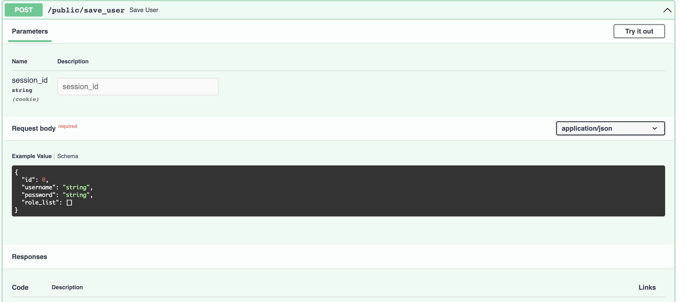

# NoNameOrm

NoNameOrm 是一个基于 Cython 开发的对象关系映射工具俗称ORM，让用户可以用Python的语法来生成SQL语句，同时它具有更高的性能表现和健全的类型提示功能

> 💡 : 有关Python的类型声明及相关功能，请参考[《Python官方文档》]()


GITHUB：[https://github.com/OToNaShi-4/NoNameOrm.git](https://github.com/OToNaShi-4/NoNameOrm.git)
GITEE：[https://gitee.com/otonashi-4/no-name-orm](https://gitee.com/otonashi-4/no-name-orm)

## NoNameOrm的优势

-----

### 1. 更好的性能
如本文开头所讲，本工具大量采用Cython 语言开发，经过编译后，能比原生Pyhton高出至少30% 的性能。


### 2. 健全的类型提示
本工具在所有的Api接口中均使用Typing进行类型声明，用户在使用过程中无论什么IDE都能给出优秀的分支预测能力和类型提示


### 3. 更易读的查询语句
本工具使用python的条件判断语法来书写过滤条件

```python
table.getExecutor().findAllBy(table.id == 1) # 单条件

table.getExecutor().findAllBy((table.id == 1) & (table.is_enable == True)) # 多条件
```

同时亦可以用如下方式查询

```python
table.getExecutor().findAnyMatch(table(id=1))
```

### 4. 第三方库支持优秀
于许多其他的 ORM 工具不同， NoNameOrm的所有查询结果 和 数据模型实例均是继承自 Pyhton 原生数据类型的，如：( **list** , **dict** )。 因此工具中所有的查询结果，和模型实例均可直接传给任何第三方的工具库使用

下面演示一下 FastApi 框架中，使用NoNameOrm的场景：
```python
@router.get('/user/list')
async def user_list():
 # 查询结果可直接返回给 FastApi 解析，无需任何额外的操作
	return await User.getExecutor().findAllBy()
```


### 5. 原生支持 FastApi
本人开发此工具最初的目的就是作为服务器后端的工具使用， **fastapi** 作为当前较为热门且类型支持非常优秀的后端框架，NoNameOrm 视 FastApi 的兼容性为第一目标。

下面我们定义一个接口，并声明从 **Body** 中接受一个 user 对象作为参数，并存储到数据库中，同时返回一个带有相应主键 id的user对象前端：

```python
@router.post('/public/save_user') # 声明接口 /public/save_user 为 POST 
async def create_user(user: User.MODEL) -> User.MODEL: # 声明接受一个user对象
	return await User.getExecutor().save(user) # 保存并返回带id的user对象
```

这时我们将 fastapi 启动就可以在 接口文档中看到我们上面所写的接口：



### 6. 同时支持 Async 和 Sync
在当下，异步(Async)已经是主流， NonameOrm 在开发之初就是奔着支持 **异步** 支持去的。
NonameOrm 可以根据你所使用的 链接判断是使用 同步模式还是异步模式。

## 安装

------
本工具已发布到 **Pypi** , 用户可根据需要选择使用源码安装还是使用pip进行安装。

### 使用PIP工具安装
本工具已发布 **Windows** **macOS(M1 chip)**  平台下各版本的二进制包( **wheel** ), 各位无需另行编译

```bash
pip install NonameOrm
```

### 从源码进行安装（不推荐）
若您想从源码进行安装你需要提前做好以下准备
1. 确保系统拥有 **C 编译环境** (其中Windows系统需要安装**visual studio**，MacOS需要**XCode**)
2. 使用下面的命令安装 **Cython** ( `pip install Cython` )
3. 从GIT仓库中下载源码

当您完成以上的准备之后就可以在项目目录下执行下面的命令进行安装：

```bash
python setup.py install
```

## 快速入门

-----
有关快速入门请参阅 [快速入门](./快速入门/index)

## License

-----
This project is licensed under the terms of the **MIT license**.